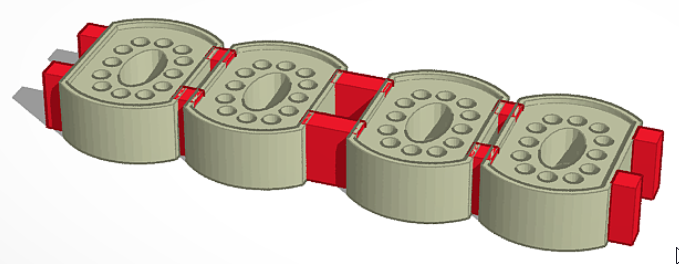
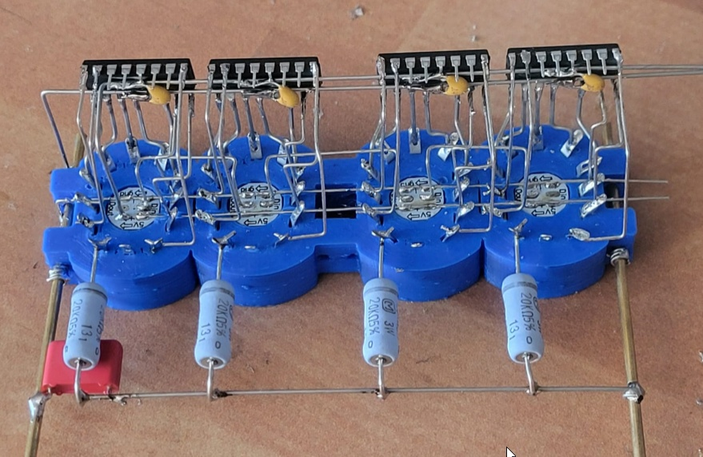
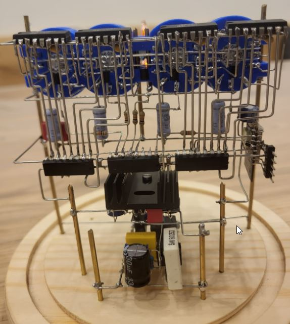
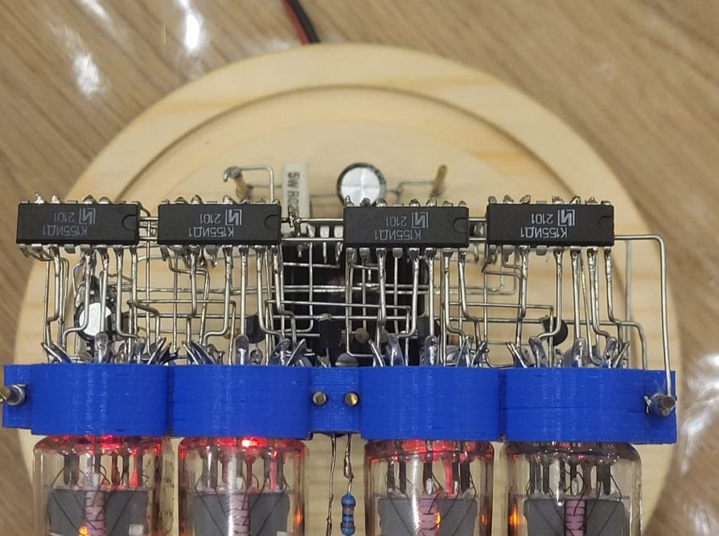
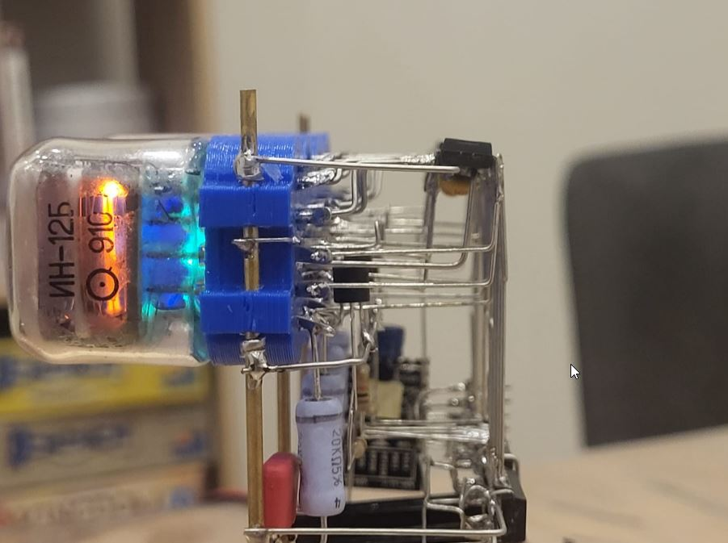
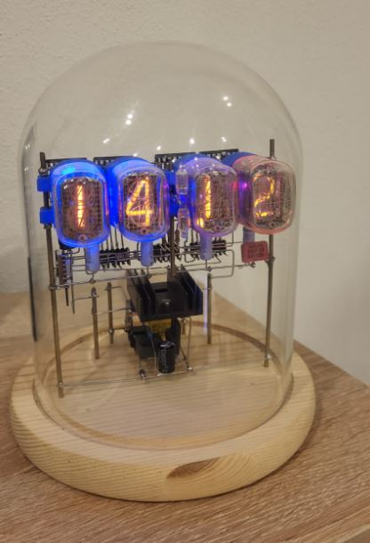
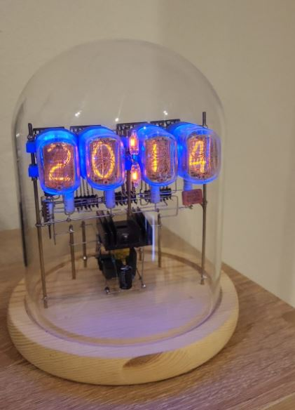

# Nixie Clock mit ESP 8266

Hier stelle ich mein Projekt vor, wie ich aus einem Nixie-Clock Steam Punk Bausatz und einen ESP8266 eine Nixie-Uhr gebaut habe.

## Nixie Clock Bausatz

Den Bausatz findet man auf Ali-Express oder Ebay unter `Vintage IN-12 Nixie Clock`.

Der Bausatz enthält eigentlich alles, was man zum Bau einer Uhr benötigt:
- Glaskuppel
- Hölzerne Bodenplatte
- Nixie Röhren (Achtung, es werden auch Bausätze ohne Röhren angeboten)
- Versilberte Drähte
- Alle notwendigen Bauteile wie Röhrentreiber, Spannungsregler, RTC-Chip und vorprogrammierten Controller etc.

## Modifikationen

Was mir an dem Bausatz nicht gefallen hat, war die Tatsache dass keine Röhrensockel dabei waren und der vorprogrammierte Atmel-Controller.

Deshalb habe ich entschieden, den Atmel-Controller + RTC-Chip durch einen ESP-8266 zu ersetzen und einen Röhrensockel zu drucken.

### Nixie Sockel

Dazu habe ich auf Tinkercad einen [Nixie Sockel](https://www.tinkercad.com/things/6y6FLwPQoSc-nixie-sockel) erstellt und ausgedruckt

Als Steckkontakte habe ich bei Amazon [Lötösen](https://www.amazon.de/gp/product/B07YLLM53J) bestellt.

### ESP8266

Da ich für den Atmel-Controller keine Firmware hatte, war schnell klar, dass da was selbst programmierbares her muss. Deshalb habe ich den Atmel und RTC Chip durch einen esp8266-Controller ersetzt.

Die Vorteile liegen auf der Hand:
- über den esp8266 kann die Zeit per NTP aus dem Internet geholt werden
- durch die eigene Firmware musste ich mich nicht so exakt an den Verdrahtungsplan halten:

  Bei der Verdrahtung der Schieberegister und der Röhrentreiber ging ich immer den kreuzungsfreisten Weg. So ist z.B. der Ausgang mit Segement 1 tatsächlich mit Segement 3 verbunden etc. Die Korrektur erfolgt dann (unsichtbar) in Software

- Es wurden noch weitere Spielereien implementiert, wie z.B. WS2812 RGB Leds hinter den Röhren, welche für einen blauen oder roten Glüheffekt sorgen

- Weitere Spielereien wären denkbar, z.B. Messwerte aus der Home-Automation per MQTT zu schicken

### Aufbau

Nachdem alles gründlich vermessen war und ich den Sockel ausgedruckt habe, begann ich mit dem Aufbau.

Hier habe ich darauf geachtet, die Silberdrähte möglichst exakt zu biegen und soweit wie möglich sauber zu arbeiten.

Dieses Bild zeigt
- 3D gedruckter Röhrensockel 
- kreuzungsfrei verbundene Röhrentreiber
- WS2812 LEDs im Röhrensockel
- unten Anodenwiderstände
- links Masse
- rechts Anodenzuleitung +180V   

### Fertig aufgebaut

- Rechts sieht man den ESP mit den Programmierheader.
- Unten ist das Hochvolt-Netzteil, sowie ein Spannungsregler für 5V + 3,3V
- Über die Messingdrähte wird GND, +3,3V, +5V und +180V nach oben geleitet
- Ganz hinten sieht man die 3 Schieberegister (SN74HC595N)
- Am Röhrensockel erkennt man noch ein paar Transistoren und die RGB-LEDs
- Oben befinden sich 4 russische К155ИД1 Röhrentreiber

Funktionsablauf
- Der ESP8266 steuert die Schieberegister und die RGB Leds an
- 2 der 3 Schieberegister steuern die 4 russischen К155ИД1 Röhrentreiber an
- die restlichen Ausgänge steuern die Dezimalpunkte, sowie den Doppelpunkt im Sekundentakt an
- Sobald der ESP8266 hoch fährt, holt er sich vom DHCP eine IP-Adresse und zeigt diese kurz an. Danach synchronisiert er seine interne Uhr mit einem NTP Server
- Es wird dann abwechselnd Datum und Uhrzeit angezeigt
- Ebenfalls gibt es einen Fader-Effekt, der die LEDs abwechselnd zwischen rot und blau wechseln lässt

### Weitere Bilder

**Ansicht von oben**

Hier sieht man die Röhrentreiber

----

**Ansicht von der Seite**

Hier sieht man, wie die Silberdrähte gebogen sind

----

**Anzeige des Datums**

Angezeigt wird der 14.12

Beim Datum erscheint ein Dezimalpunkt zwischen Tag und Monat

----

**Anzeige der Uhrzeit**

Angezeigt wird 20:14

Die Datums und Uhrzeitanzeige wechselt ca. alle 12 sek. Zwischen dem Wechsel gibt es einen "Rolling Number Effekt". Dabei werden kurz alle Segemente der Reihe nach angesteuert, so dass sich die Segemente freibrennen und die Röhren länger halten 